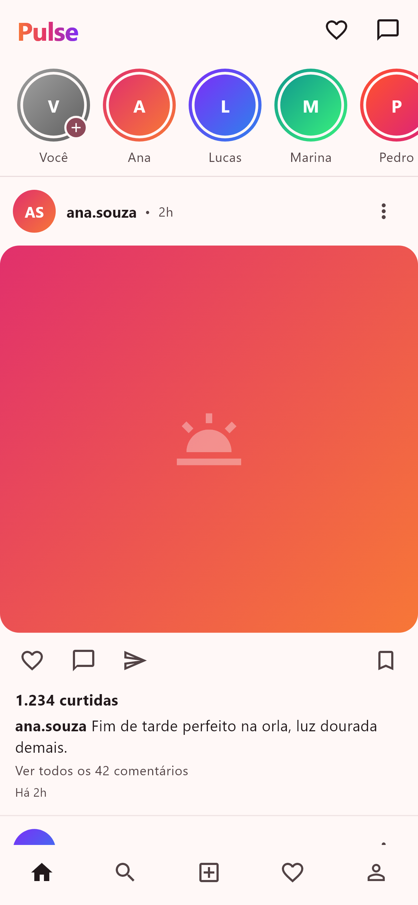
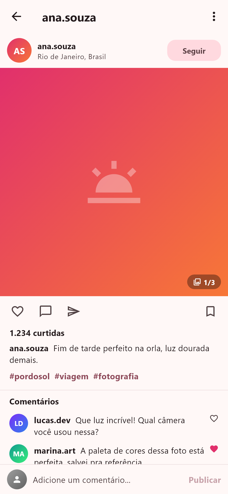
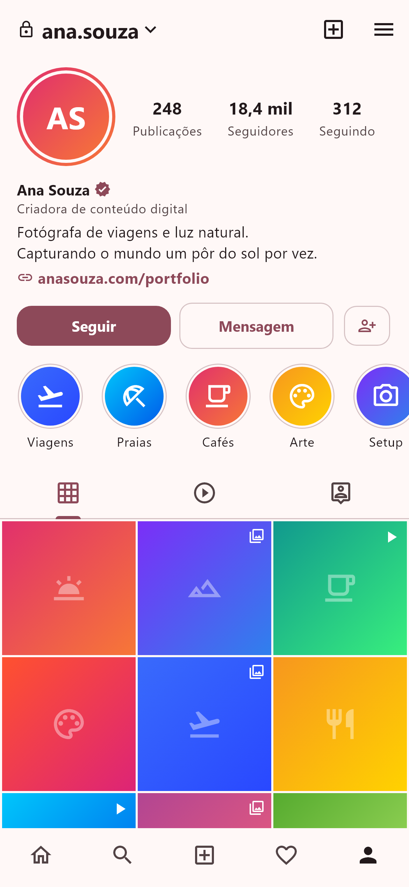
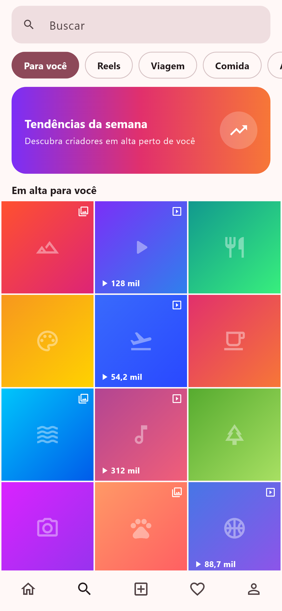
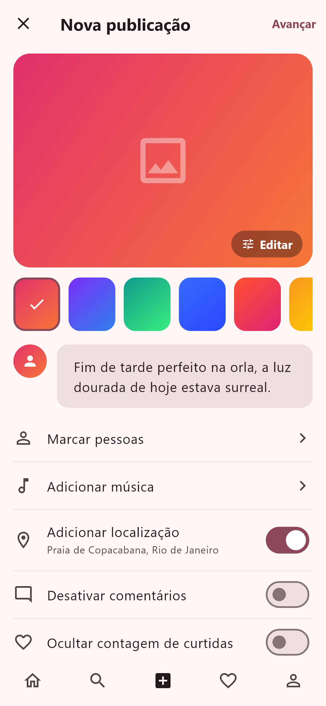
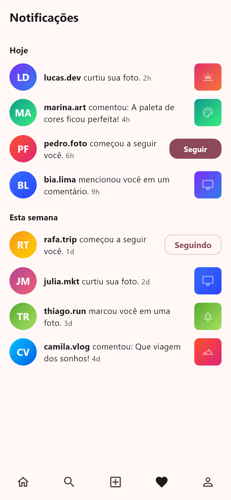

# Flutter Social

[Leia em português](./README.pt-BR.md)

[](./LICENSE) 

Flutter Social is a free social network template (Instagram-style, the demo app is called "Pulse") built with Flutter 3.44 and Material 3. It has 8 screens: a feed with stories and posts, post detail, a comment thread, a profile with stats and a post grid, an explore page, a post composer, grouped notifications and a direct message inbox. The UI is drawn with gradients and icons only, with no network images, so everything renders offline. Data comes from mocked repositories; the service classes mark where a real API plugs in.

## Screens

8 screens. Five of them are bottom navigation branches; messages, post detail and comments are pushed go_router routes:

- Feed (`/`): stories row and post cards with likes and comments.
- Explore (`/explore`): discovery grid.
- Create post (`/create`): post composer.
- Notifications (`/notifications`): notifications grouped by type.
- Profile (`/profile`): user stats and post grid.
- Messages (`/messages`): direct message inbox.
- Post (`/post/:id`): single post detail.
- Comments (`/post/:id/comments`): comment thread for a post.

## Screenshots

The `screenshots/` folder contains 16 PNGs: a light and a dark capture of each screen, generated by `test/print_test.dart`. A sample:








## Tech stack

| Package | Version |
| --- | --- |
| Flutter | 3.44 (stable) |
| Dart SDK | `^3.12.2` |
| go_router | `^17.3.0` |
| provider | `^6.1.5+1` |
| http | `^1.6.0` |
| intl | `^0.20.3` |
| cupertino_icons | `^1.0.8` |
| flutter_lints (dev) | `^6.0.0` |

Material 3 is enabled through `useMaterial3: true` with a seed-based color scheme.

## Requirements

- Flutter SDK, stable channel. The template was built with Flutter 3.44; `pubspec.lock` resolves with Flutter 3.38.0 or newer and Dart `>=3.12.2 <4.0.0`.
- No backend, API keys or environment variables.
- The usual platform toolchains for the targets you build: Android SDK for APKs, Xcode on macOS for iOS, Chrome for web, Visual Studio with the C++ workload for Windows. The repo ships `android/`, `ios/`, `web/` and `windows/` folders.

## Getting started

```bash
flutter pub get
flutter run
```

`flutter run` uses the connected device. List targets with `flutter devices` and pick one with `-d`, for example `flutter run -d chrome` for web or `flutter run -d windows` for desktop.

## Builds

```bash
flutter build apk        # Android
flutter build ipa        # iOS (requires macOS and Xcode)
flutter build web        # web output in build/web
flutter build windows    # Windows desktop
```

## Tests

`flutter test` runs the widget tests in `test/widget_test.dart`. `test/print_test.dart` (with helpers in `test/golden_utils.dart`) renders every screen in both themes and writes the PNGs in `screenshots/`.

## Project structure

```
lib/
  main.dart                 # entry point
  app.dart                  # MaterialApp.router, builds the router with a PostRepository
  core/
    router.dart             # go_router route table (5 branches + pushed routes)
    theme.dart              # AppTheme: seed color and component themes
    format.dart             # formatting helpers (counts, timestamps)
  data/
    models/                 # API models (post, comment) with fromJson/toJson
    services/               # http-based post and comment API services (mocked)
    repositories/           # post, comment, message, notification, profile repositories
  domain/
    models/                 # Post, Comment, Profile, Conversation, NotificationItem, ExploreTile
  ui/
    core/widgets/           # shared widgets, including SocialBottomNav
    features/<feature>/
      views/                # one screen per feature
      view_models/          # ChangeNotifier view models (MVVM)
```

## Architecture and state management

The code follows a layered architecture (data, domain, ui) with MVVM. Each screen has a `ChangeNotifier` view model injected via `provider`. Unlike the single-repository templates in this series, this one splits the data layer into five repositories (post, comment, message, notification, profile); `app.dart` builds the router with a `PostRepository` instance. Navigation is declarative with go_router: five bottom navigation branches plus `/messages` and `/post/:id` with a nested `comments` route.

## Theming and customization

The theme is centralized in `lib/core/theme.dart`. Colors derive from a single seed color (`AppTheme.seed`, `0xFFE1306C`, an Instagram-like magenta); change it and `ColorScheme.fromSeed` regenerates both the light and the dark palettes. The same file sets the font family (Roboto) and the component themes for buttons and inputs. Story rings and post placeholders are gradients, so no image assets are involved. The app follows the system brightness because `app.dart` passes both `theme` and `darkTheme` to `MaterialApp.router`.

## More templates

This template is part of the catalog at https://template.dev.br, which lists free and paid templates with previews.

## Support this project

Donations keep the free templates maintained and compatible with new Flutter releases. If this one is useful to you, you can contribute any amount at https://template.dev.br/doar?template=flutter-social.

## License

MIT, see [LICENSE](./LICENSE). Copyright 2026 Danilo Quinelato.
